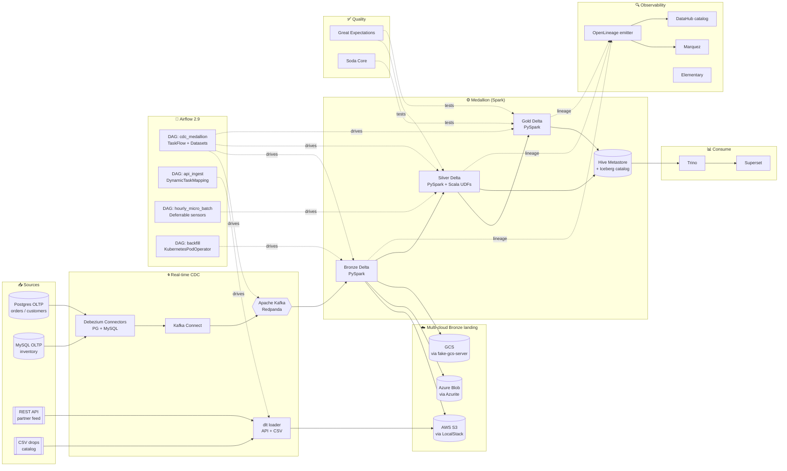

# airflow-multicloud-medallion-platform

Production-grade **Apache Airflow 2.9** orchestrator driving an end-to-end medallion data platform across **three clouds** (AWS via LocalStack, Azure via Azurite, GCP via fake-gcs-server). Debezium-based CDC → Kafka → PySpark + Scala-Spark medallion → Delta Lake on Hive Metastore → Great Expectations DQ → **OpenLineage** → Marquez + **DataHub** catalog.


---

## Architecture



Full **sequence diagrams** in [`docs/architecture.md`](docs/architecture.md).

---

## Tech highlights

| Capability | Tools |
|---|---|
| **Orchestration** | Airflow 2.9 (TaskFlow, datasets, dynamic task mapping, task groups, pools, SLAs, deferrable sensors, KubernetesPodOperator, callbacks) |
| **CDC** | Debezium 2.6 connectors for Postgres + MySQL |
| **Streaming** | Kafka (Redpanda), Kafka Connect |
| **Ingestion** | dlt (data load tool) for API + CSV paths |
| **Transformation** | PySpark 3.5, Scala-Spark (SBT) custom UDFs, Delta Lake |
| **Catalog** | Hive Metastore, Iceberg REST catalog (Nessie), AWS Glue via LocalStack |
| **Data Quality** | Great Expectations 0.18, Soda Core |
| **Lineage** | OpenLineage emitter → Marquez + DataHub |
| **Multi-cloud** | AWS S3 (LocalStack), Azure Blob (Azurite), GCS (fake-gcs-server) |
| **Query** | Trino (Starburst OSS), Superset |
| **Legacy pattern** | Hive + Sqoop ingestion demo (documented & scripted) |
| **Languages** | Python, **Scala** (Spark UDFs), **Java** (custom operator), SQL, Shell |
| **IaC** | Terraform + Terraform CDK |
| **CI/CD** | GitHub Actions (lint + DAG import + unit tests + JSON validate), Jenkinsfile, GitLab CI |

---

## Quickstart

```bash
make install
make lint              # ruff + black + yamllint
make test              # DAG import + helper unit tests
make compose-up        # full stack (LocalStack + Azurite + Kafka + Airflow + Marquez)
make airflow-ui        # http://localhost:8080
make trigger-cdc       # trigger cdc_medallion DAG
make marquez-ui        # http://localhost:3000
make datahub-ui        # http://localhost:9002
```

---

## Project layout

```
airflow-multicloud-medallion-platform/
├── .github/workflows/ci.yml
├── Makefile, Jenkinsfile, .gitlab-ci.yml, docker-compose.yml
├── docs/                    # architecture, runbook, lineage guide
├── airflow/
│   ├── dags/                # 4 DAGs showcasing different Airflow 2.9 features
│   ├── plugins/
│   │   ├── operators/       # custom operators (Delta merge, Azure, ODCS contract)
│   │   ├── sensors/         # deferrable sensors
│   │   ├── hooks/           # Azurite, Nessie, Marquez hooks
│   │   └── lineage/         # OpenLineage backend config
│   └── include/             # shared helpers used by DAGs
├── src/
│   ├── pyspark/             # bronze/silver/gold PySpark jobs
│   ├── scala/               # Scala-Spark module (SBT) with UDFs
│   ├── debezium/            # connector JSON configs (PG, MySQL)
│   ├── dlt/                 # dlt pipelines for API + CSV
│   ├── ge/                  # Great Expectations project
│   ├── hive/                # metastore bootstrap SQL
│   └── sqoop/               # legacy Sqoop commands (documented)
├── infra/
│   ├── terraform/           # HCL — buckets, metastore, Marquez backend
│   └── azurite/             # Azurite config + containers seed
├── tests/
│   ├── unit/                # pure-python tests
│   └── dags/                # Airflow DagBag import tests (no docker)
├── scripts/                 # bootstrap, seed, trigger
├── configs/                 # OpenMetadata, Great Expectations, Soda, Trino
└── data/samples/
```

---

## Zero-cost posture

Every cloud in the architecture has a free local substitute (LocalStack, Azurite, fake-gcs-server, Redpanda, Marquez, DataHub). Production configs for each cloud are committed verbatim and documented in `docs/cloud-parity.md`.

## License

MIT.
