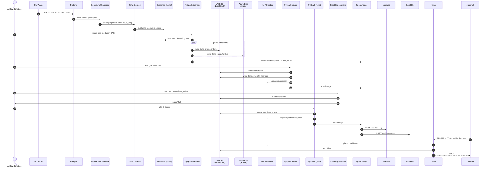
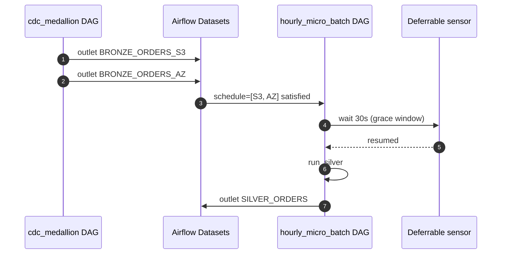
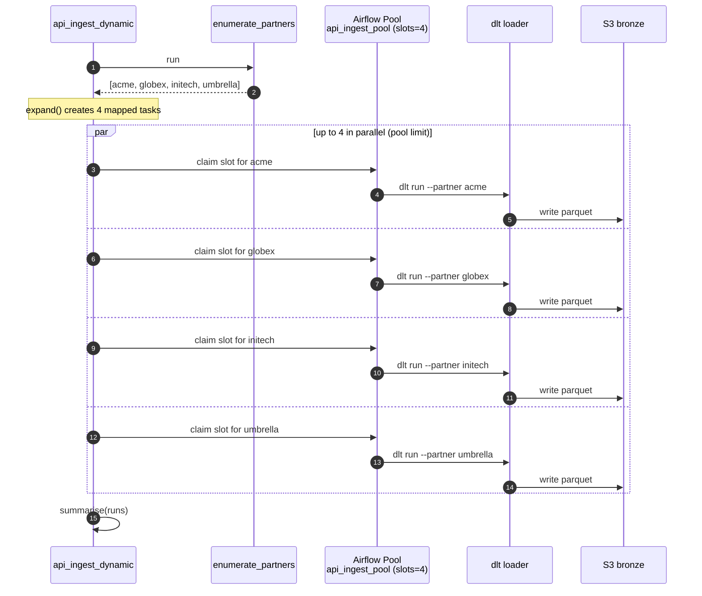
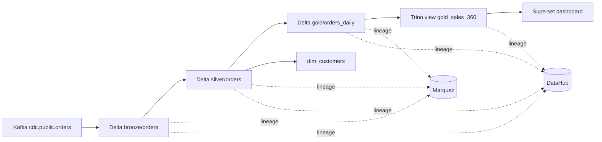

# Architecture — Sequence Diagrams

## 1. End-to-end CDC → medallion (one hour)

```mermaid
sequenceDiagram
    autonumber
    actor Sched as Airflow Scheduler
    participant APP as OLTP App
    participant PG as Postgres
    participant DBZ as Debezium Connector
    participant KC as Kafka Connect
    participant KFK as Redpanda (Kafka)
    participant SPK as PySpark (bronze)
    participant S3 as AWS S3<br/>(LocalStack)
    participant AZB as Azure Blob<br/>(Azurite)
    participant HMS as Hive Metastore
    participant SLV as PySpark (silver)
    participant GLD as PySpark (gold)
    participant GE as Great Expectations
    participant OL as OpenLineage
    participant MQ as Marquez
    participant DH as DataHub
    participant TR as Trino
    participant SUP as Superset

    APP->>PG: INSERT/UPDATE/DELETE orders
    PG->>DBZ: WAL entries (pgoutput)
    DBZ->>KC: envelope {before, after, op, ts_ms}
    KC->>KFK: publish to cdc.public.orders
    Sched->>SPK: trigger cdc_medallion DAG
    SPK->>KFK: Structured Streaming read
    par fan out to clouds
        SPK->>S3: write Delta bronze/orders
        SPK->>AZB: write Delta bronze/orders
    end
    SPK->>OL: emit input(kafka)+output(delta) facets
    Sched->>SLV: after grace window
    SLV->>S3: read Delta bronze
    SLV->>S3: write Delta silver (PII hashed)
    SLV->>HMS: register silver.orders
    SLV->>OL: emit lineage
    Sched->>GE: run checkpoint silver_orders
    GE->>S3: read silver.orders
    GE->>Sched: pass / fail
    Sched->>GLD: after GE pass
    GLD->>S3: aggregate silver → gold
    GLD->>HMS: register gold.orders_daily
    GLD->>OL: emit lineage
    OL->>MQ: POST /api/v1/lineage
    OL->>DH: POST /entities/dataset
    SUP->>TR: SELECT ... FROM gold.orders_daily
    TR->>HMS: plan + read Delta
    TR->>S3: fetch files
    TR-->>SUP: result
```

## 2. Dataset-triggered downstream flow

```mermaid
sequenceDiagram
    autonumber
    participant CDC as cdc_medallion DAG
    participant DS as Airflow Datasets
    participant DOWN as hourly_micro_batch DAG
    participant DEF as Deferrable sensor

    CDC->>DS: outlet BRONZE_ORDERS_S3
    CDC->>DS: outlet BRONZE_ORDERS_AZ
    DS->>DOWN: schedule=[S3, AZ] satisfied
    DOWN->>DEF: wait 30s (grace window)
    DEF-->>DOWN: resumed
    DOWN->>DOWN: run_silver
    DOWN->>DS: outlet SILVER_ORDERS
```

## 3. Dynamic task mapping (api_ingest)

```mermaid
sequenceDiagram
    autonumber
    participant DAG as api_ingest_dynamic
    participant FN1 as enumerate_partners
    participant POOL as Airflow Pool<br/>api_ingest_pool (slots=4)
    participant DLT as dlt loader
    participant S3 as S3 bronze

    DAG->>FN1: run
    FN1-->>DAG: [acme, globex, initech, umbrella]
    Note over DAG: expand() creates 4 mapped tasks
    par up to 4 in parallel (pool limit)
        DAG->>POOL: claim slot for acme
        POOL->>DLT: dlt run --partner acme
        DLT->>S3: write parquet
    and
        DAG->>POOL: claim slot for globex
        POOL->>DLT: dlt run --partner globex
        DLT->>S3: write parquet
    and
        DAG->>POOL: claim slot for initech
        POOL->>DLT: dlt run --partner initech
        DLT->>S3: write parquet
    and
        DAG->>POOL: claim slot for umbrella
        POOL->>DLT: dlt run --partner umbrella
        DLT->>S3: write parquet
    end
    DAG->>DAG: summarise(runs)
```

## 4. Lineage fan-out

```mermaid
flowchart LR
    K[Kafka cdc.public.orders] --> B[Delta bronze/orders]
    B --> S[Delta silver/orders]
    S --> G[Delta gold/orders_daily]
    S --> D[dim_customers]
    G --> T[Trino view gold_sales_360]
    T --> SS[Superset dashboard]

    B -.lineage.-> M[(Marquez)]
    S -.lineage.-> M
    G -.lineage.-> M
    B -.lineage.-> DH[(DataHub)]
    S -.lineage.-> DH
    G -.lineage.-> DH
    T -.lineage.-> DH
```
